# 와이 커뮤니케이션 아나운서 인력풀
## Y Communication Professional Announcers & MC Pool

> *검증된 방송 실전 경력을 보유한 최정상급 전문 인력*

---

## 아나운서

### 오수화
**대표**

📍 소속: 와이 커뮤니케이션

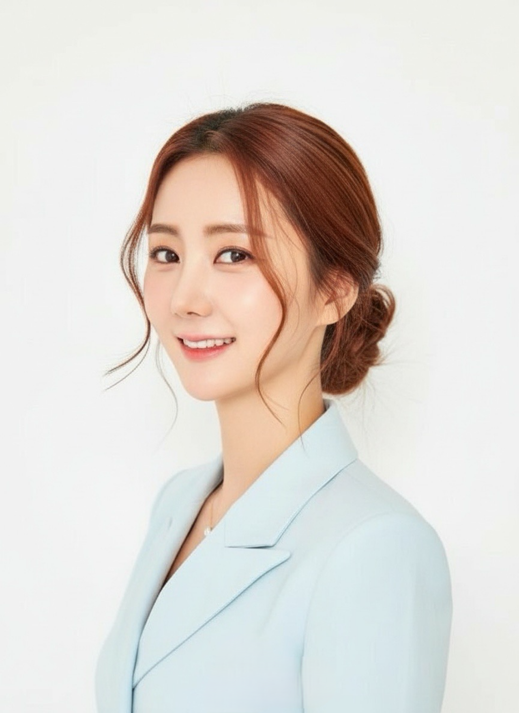

#### 학력
- 숙명여자대학교 TESOL 대학원 석사 과정
- 숙명여자대학교 영어영문학 학사
- 국가공인 CS리더스관리사 보유
- 국제영어교사자격증 보유

#### 경력
- 현(現) 와이 커뮤니케이션 대표
- 현(現) 한국산업기술원 지방자치연구소 특임교수
- 전(前) 한국경제TV 아나운서
- 쇼호스트 (W쇼핑, 홈앤쇼핑, CJ온스타일 등 1,000회 이상 진행)
- US ARMY 근무 경력 및 다수의 영어 MC 진행

#### 수상
- 2022년 한국방송진행자협회 쇼호스트상 수상
- 2022년 미스 인터네셔널 "진(眞)" 수상 (슈퍼퀸 미인대회 대상)
- 2022년 국방부 봉사대상 및 한미친선 증진 감사장

---

### 이서진
**아나운서/교수**

📍 소속: TBC 대구방송

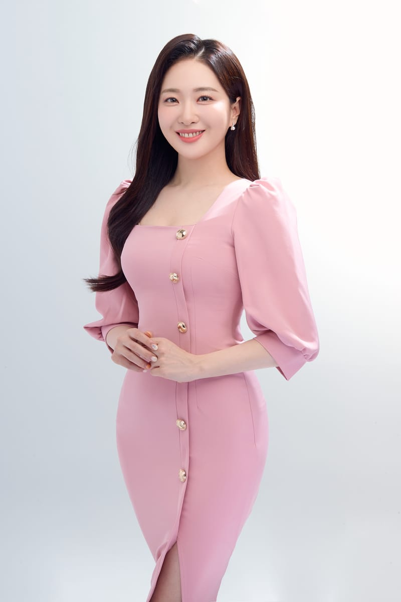

#### 경력
- TBC 대구방송 아나운서
- 수협사내방송 아나운서
- 연합인포맥스 MC
- 신세계TV쇼핑 리포터
- 생활건강TV 리포터
- 라이브커머스 쇼호스트 (7년 차)
- TV 홈쇼핑 (롯데, NS, K쇼핑) 쇼호스트
- 봄온, 로엘, 라라스테이션 쇼호스트 아카데미 교수
- 서울외국어대학원대학교 겸임교수 (2022.12~)
- 서울특별시평생교육진흥원 강사
- 콜로소 세일즈전문가 교육 런칭 교수

---

### 박새하
**아나운서/교수**

📍 소속: MBC

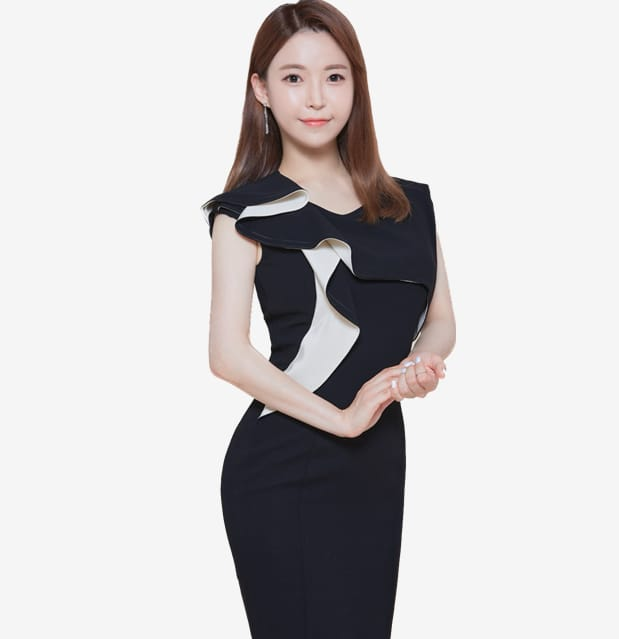

#### 경력
- MBC 생방송 오늘아침 진행
- 연합뉴스 Y스페셜 진행
- 육아방송 조영구 신재은의 육아매거진 리포터
- FoodTV 뉴스&매거진 진행
- 부동산 소개 플랫폼 '직방' 아나운서
- 시흥시청 정책홍보프로그램 <시흥은 정책EZ> 진행
- 서민금융진흥원 교육프로그램 진행
- 노동부&한국산업기술대학교 <경력단절 안녕, 오늘부터 워킹맘> 진행
- KOBA TV (LIVE) 진행
- 교육부 교원 육성 프로그램 <모아우아> 진행

---

### 송혜지
**아나운서/교수**

📍 소속: MBC경남

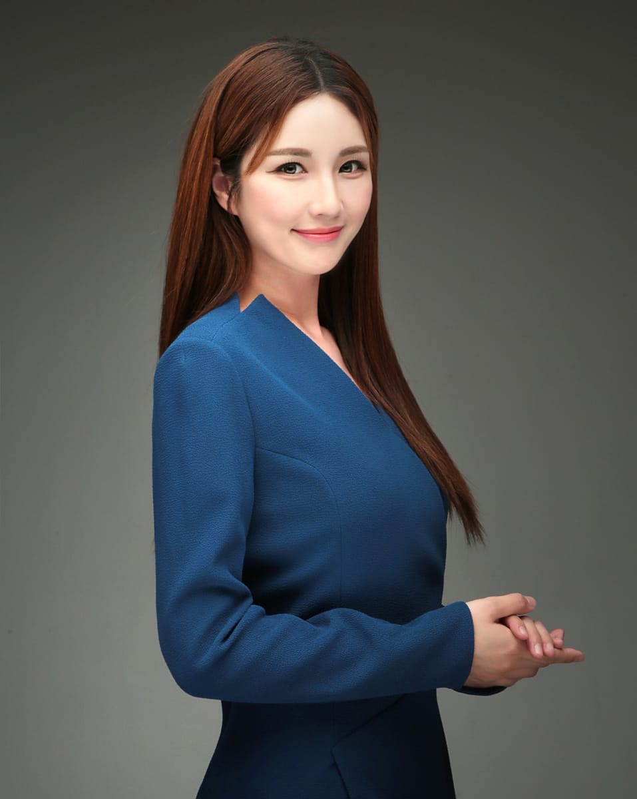

#### 경력
- MBC경남 기상캐스터
- SBS대구 기상캐스터
- KTV 국회정책방송 뉴스
- 삼성전자 SEDEX 진행
- 한국IR대상 시상식 진행
- 대형 기업 행사 진행 다수
- 국가기관 행사 진행
- 교육청, 정부기관 세미나 정책 행사 진행
- 연예인 콘서트 토크쇼 문화행사 진행
- 생명보험 자격증 보유로 보험 광고 및 IPTV광고 진행
- 아파트, 모델하우스 광고 영상 진행
- 뷰티, 헬스케어, 제품광고 다수 진행

---

### 권소아
**앵커/한영 아나운서**

📍 소속: 아리랑국제방송

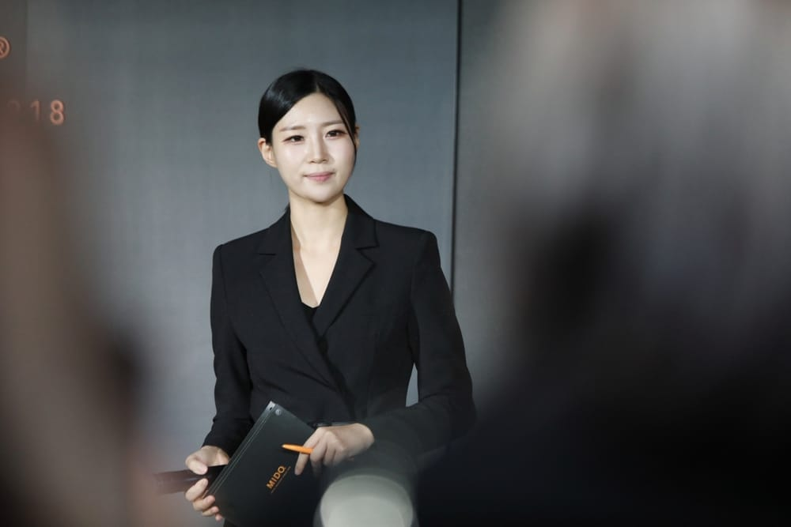

#### 학력
- 한국외국어대학교 독일어통번역학과/영어통번역학과 (학사)

#### 경력
- 아리랑국제방송 앵커/기자
- 한국어, 영어, 독일어, 프랑스어 구사
- 아리랑TV 앵커 [K-Culture Dive] [The Kulture Wave]
- 아리랑TV 보도기자 (정치부, 경제부, 외교부 출입기자)
- 아리랑라디오 [Korea Now] [Good Morning Seoul]
- TBS eFM 앵커/기자
- tvN 유 퀴즈 온 더 블록 253회 "누구보다 간절하다" 편 출연
- EBS 세계테마기행 "꿈꾸던 가을로 캐나다 동부" 편
- G20 서울 정상회의 KBS World G20TV 생중계

---

### 정민향
**한영 아나운서**

📍 소속: 국제행사 전문

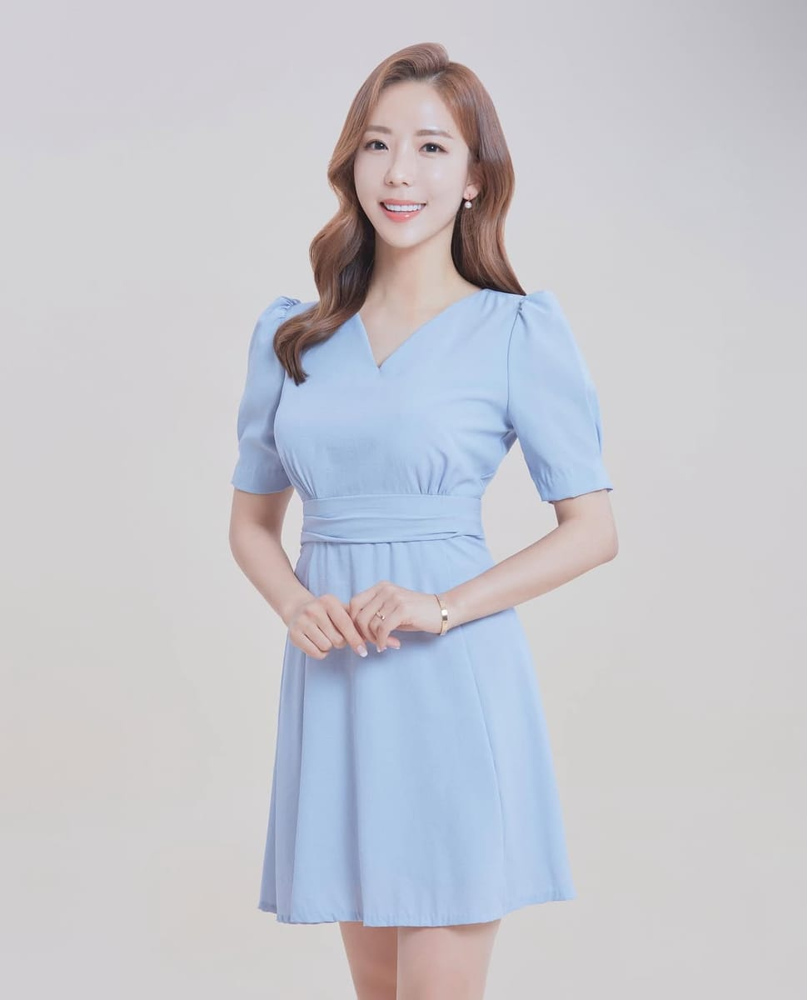

#### 학력
- Native Speaker – 캐나다 10년 거주

#### 경력
- 국제행사 전문 영어 아나운서
- JTBC 아침 뉴스
- KTV - 생활&정책
- CJ ENM 영어 사내뉴스
- 스포티비
- 한국경제TV
- G1강원민방(강원SBS)

---

### 손세종
**아나운서/교수**

📍 소속: 애터미

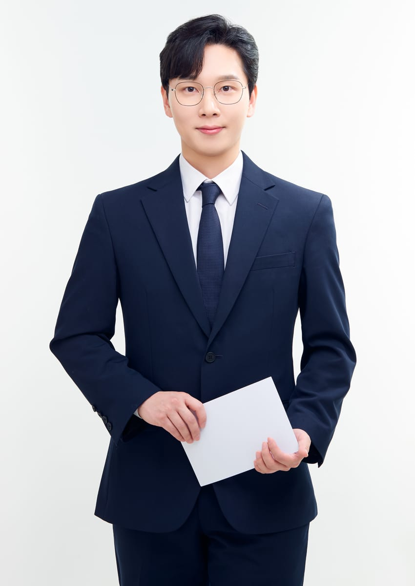

#### 경력
- 라이브커머스 쇼호스트 - 1,500회 이상 방송 진행
- 영양사 쇼호스트 (영양사 면허증 보유)
- 건강기능식품 전문가 (업계 8년차)
- 애터미 전속 아나운서
- 세일즈 전문 강사 (삼성, 교보화재, 유니베라, LG 생활건강)
- KBS홀 16회 사랑의바이올린 음악회 진행
- 세금(부가세) 컨텐츠 아나운서
- LG에너지 솔루션 사내 컨텐츠
- 네이버 AI 컨텐츠
- 스튜디오 몰링_영슐랭 진행자
- 김미경의 ONE PICK 게스트
- 전문 결혼식 사회자
- 이외 기업 행사 아나운서

---

### 이용석
**아나운서**

📍 소속: BBS불교방송

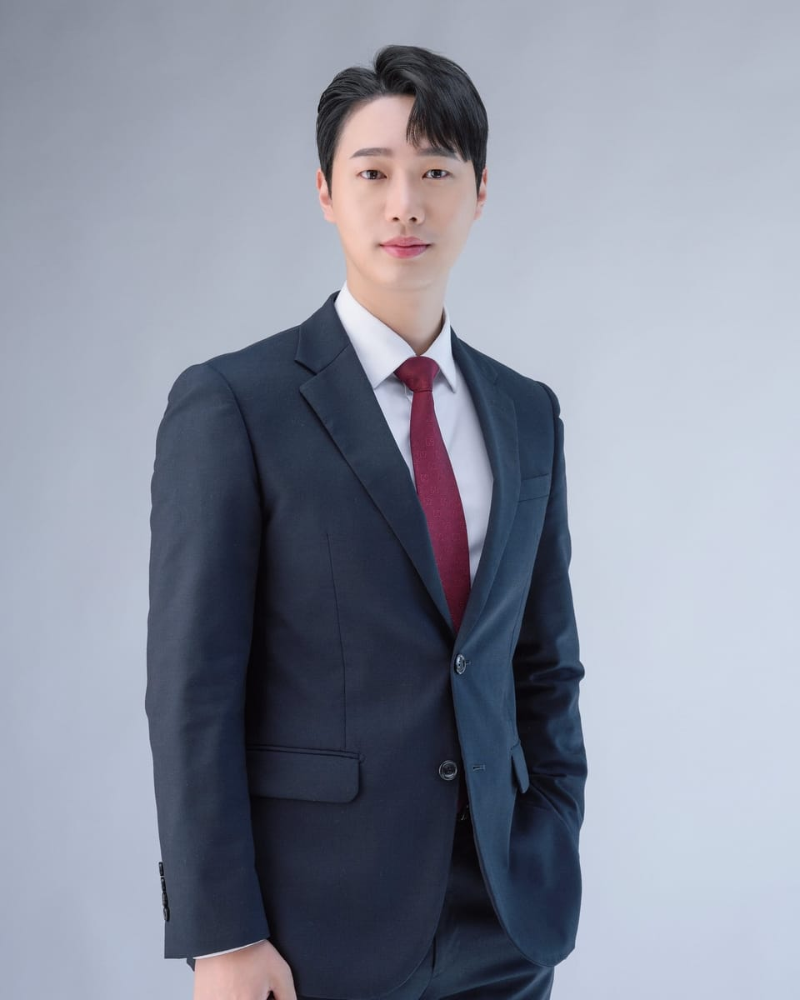

#### 경력
- SBS광주방송 아나운서
- 서울경제TV 아나운서
- 코레일 아나운서
- LG헬로비전 아나운서
- 국방TV 아나운서
- BBS불교방송 아나운서
- HD현대건설기계 MEX글로벌 런칭쇼 MC
- 한국은행 제주시 지역경제 심포지엄 MC
- 대한민국 소방정책 국제 심포지엄 MC
- 현대모비스 ESG아이디어톤 공유 MC
- 세종학당 수료생/후원단체 교류회 MC
- 동두천 락페스티벌 진행
- 서울 뷰티위크 행사 진행

---

### 최인경
**아나운서/교수**

📍 소속: 라이브커머스코리아

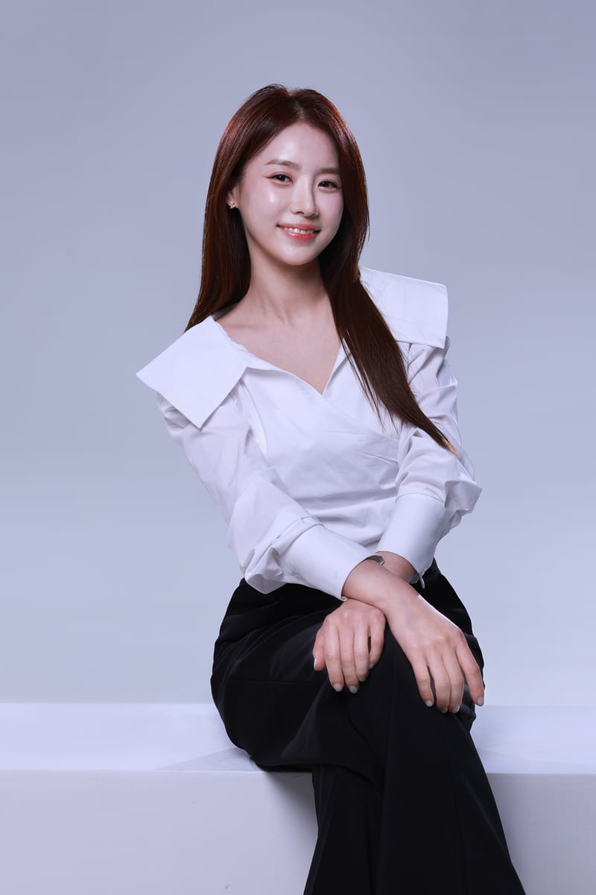

#### 경력
- [쇼호스트] 생방송 1,500회 이상 / 라이브 커머스 론칭 전문 100여개 이상 브랜드&상품
- [쇼호스트] TV커머스 W쇼핑 개국 쇼호스트(뷰티,생활,주방,건기식,식품,여행)
- [쇼호스트] TV홈쇼핑 생활&주방 전문 게스트(현대 홈쇼핑, 홈&쇼핑, NS홈쇼핑)
- [쇼호스트] 라이브 커머스 론칭 전문 쇼호스트(뷰티,생활,주방,건기식,식품,가전,유아동)
- [쇼호스트] 유한킴벌리 여성용품 4년 고정 단독 쇼호스트(좋은느낌, 화이트, 라네이처)
- [쇼호스트] 유한킴벌리 유아동 맘큐 고정 쇼호스트 4년 (더블하트, 그린핑거, 베베그로우)
- [쇼호스트] 테팔 론칭 전문 메인 쇼호스트 3년(생활, 주방)
- [쇼호스트] 코렐 론칭 전문 메인 쇼호스트 3년
- [쇼호스트] 보국전자 론칭 단독 쇼호스트 2년(계절가전 상품)
- [쇼호스트] 필립스 맨즈 뷰티 고정 쇼호스트 2년
- [쇼호스트] 필립스 소닉케어 고정 쇼호스트 2년
- [쇼호스트] 필립스 생활, 주방 고정 쇼호스트 2년
- [쇼호스트] 쿤달 고정 메인 쇼호스트 4년(뷰티, 생활)
- [쇼호스트] 바이오던스 론칭 전문 고정 쇼호스트 2년
- [쇼호스트] 메디큐브 외 디바이스 전문 론칭 쇼호스트
- [쇼호스트] 유아동 브랜드 단독 고정 쇼호스트(삠뽀요, 코디아이, 핑크퐁, 나비잠,앙블랑,베르블랑)
- [쇼호스트] 제스프리 단독 고정 쇼호스트 5년
- [쇼호스트] 아큐첵 의료기기 론칭 쇼호스트
- [스피치] 연성대학교 뷰티스타일리스트학과 비즈니스 스피치 교수
- [스피치] 연성대학교 뷰티스타일리스학과 라이브커머스 스피치 강의
- [스피치] 대림대학교 면접 스피치 및 이미지메이킹 특강 다수 진행
- [스피치] 라이브커머스 코리아 스피치(방송인/라이브커머스) 부원장
- [스피치] 청소년 쇼호스트 직업 체험 강의 다수 진행
- [TV 광고 & 인포머셜] 올레TV “골라잡쇼” 쇼호스트 패널 출연1,2회
- [TV 광고 & 인포머셜] 칼리프 블로모스 인포머셜 쇼호스트
- [TV 광고 & 인포머셜] 웰피아 마스커버 커버 쿠션 인포머셜 쇼호스트
- [TV 광고 & 인포머셜] 미츠바 인포머셜 쇼호스트
- [TV 광고 & 인포머셜] 다빔 배변 & 다이어트 인포머셜 쇼호스트
- [TV 광고 & 인포머셜] 동부화재 스마트 아이사랑 TV 광고
- [TV 광고 & 인포머셜] 에이스치과보험 TV 광고
- [행사 진행 및 리포팅] 서울 모터쇼 혼다관 전문 큐레이팅 10회
- [행사 진행 및 리포팅] 현대엔지니어링 리포팅 2회
- [행사 진행 및 리포팅] 이데일리 경제 TV-대한민국 전문기업 리포팅 & 나래이션
- [정부행사] 문화체육관광부&행정안전부: 농어촌 경제회복 프로젝트 랜선타고 팔도 미식 방송 진행
- [정부행사] 창업진흥원&롯데홈쇼핑: 쇼핑클라쓰 홍보 영상 다수 진행
- [정부행사] 2026 소상공인 지원 사업 올해의 TOPS : 영주마실 사과, 완도 활전복 외 판매 방송 진행
- [프레젠터] 대만 모모홈쇼핑 패션사업부 품평회 진행 2011
- [프레젠터] CJ 홈쇼핑, 현대 홈쇼핑 시즌 패션 품평회 진행 2011~2012
- [모델] 우먼센스 앰버서더
- [모델] 메이베나 스킨케어 모델

#### 수상
- 2023 6차 산업 박람회 – 대한민국 향토제품 대제전: 지자체 추석선물 판촉전 “최우수상”

---

### 윤채령
**아나운서**

📍 소속: 스포츠서울TV

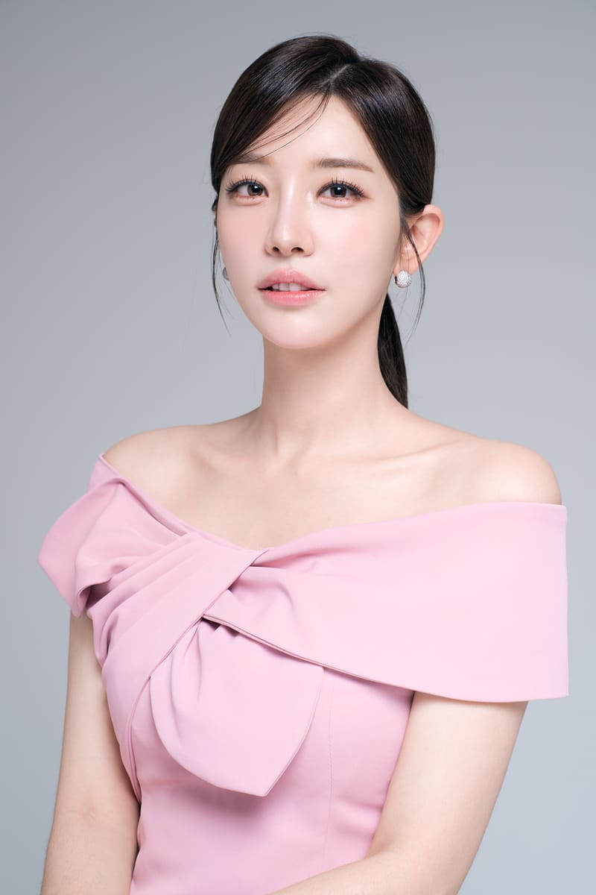

#### 경력
- 스포츠서울TV 리포터
- SBS 2012 슈퍼모델선발대회
- 숙명무용단 현대무용수
- KT알파 공채 쇼호스트
- W쇼핑 쇼호스트
- 2025 아시아모델페스티벌 한영MC
- 서울인문포럼 MC
- 충청남도 문화가족 한마당 MC
- KT 스타크래프트 게임대회 MC

---

### 사은혜
**아나운서/교수**

📍 소속: KBS 전주

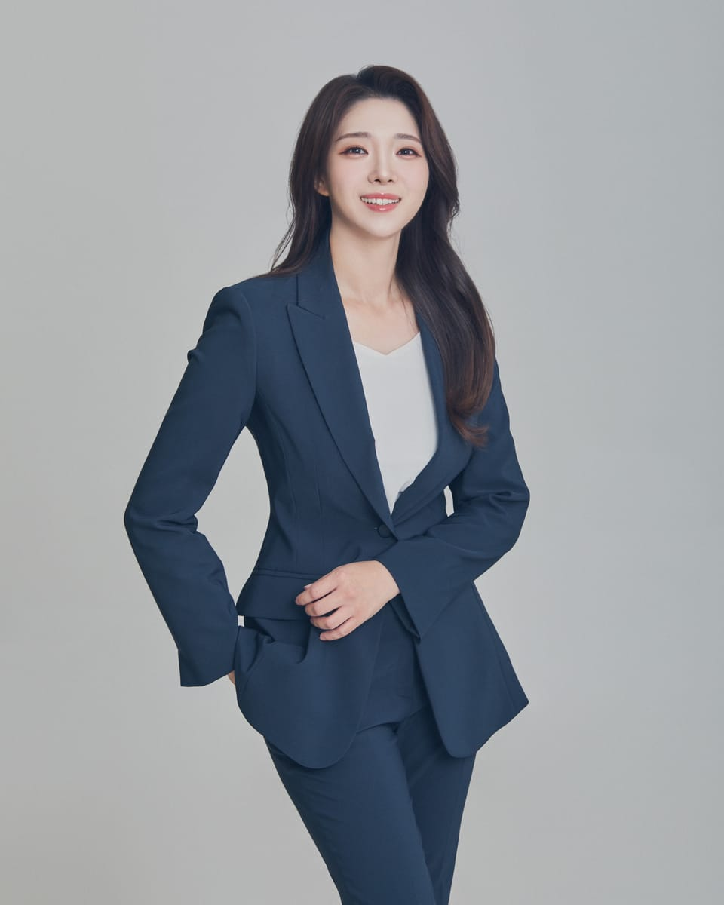

#### 경력
- KBS 전주 아나운서
- 전주 MBC 라디오 아나운서
- TBS 전북교통방송 캐스터
- K-water 협력스타트업 및 멘토단 네트워킹데이 MC
- 대전정보문화산업진흥원 메타버스 전문인력 양성교육 OT 및 명사특강
- 2023 진안고원 음식 학술대회 MC
- 전북대학교 졸업식 MC
- 김태원(부활) 토크콘서트 MC
- LS 엠트론 송년행사 MC
- 2024 세종예비청년박람회 MC
- 경제통상진흥원 성과보고회 MC
- 한국산업인력공단 해외취업 토크콘서트 MC
- 정은혜 작가 토크콘서트 <당신을 안아줄게요> MC

---

### 김민정
**아나운서/교수**

📍 소속: 한국프레젠터협회

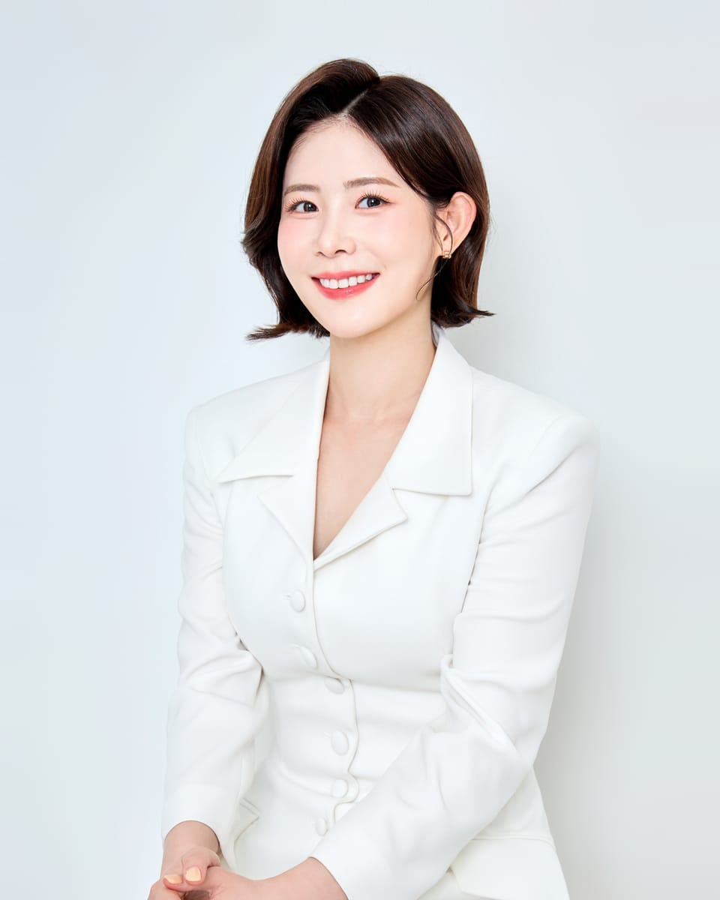

#### 경력
- 한국프레젠터협회 이사
- 전 CBS 아나운서
- 김포대학교 외래교수
- 신세계 입찰 프레젠터

---

### 정애란
**아나운서**

📍 소속: 송파구청

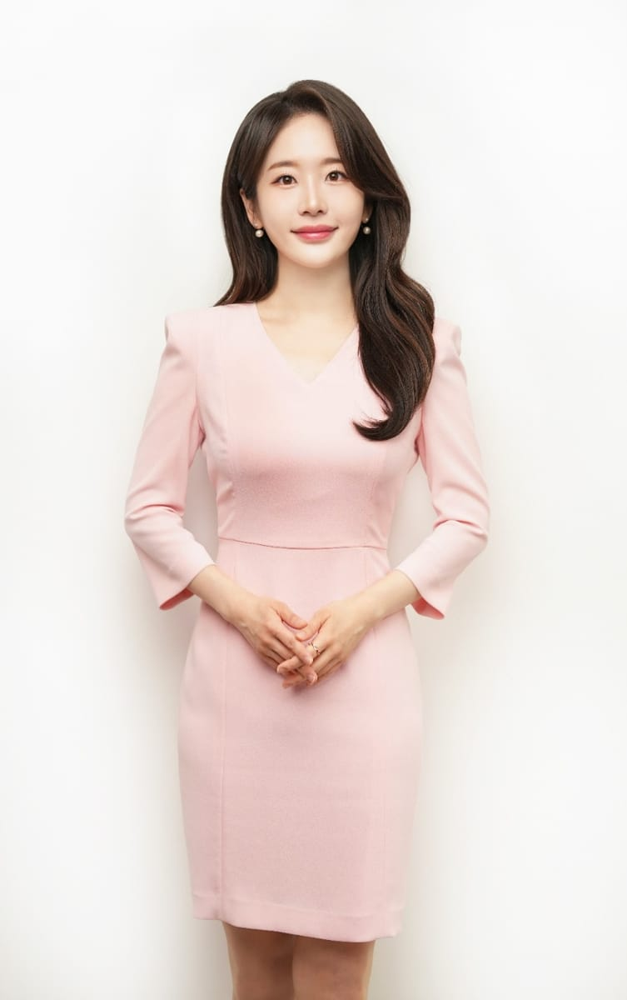

#### 경력
- 경기도의회, 송파구청, 의왕시 뉴스 진행
- CMB광주방송(광주시청) 아나운서
- DBS동아방송 아나운서
- 남동구청 아나운서
- KDB교보생명 <현장에서 On 문의> MC
- 건강보험심사평가원 뉴스
- IT 기업 웨비나 MC
- 애드포스 인사이트(블록체인) 미디어홍보팀
- 세스코 뉴스
- 아모레퍼시픽 MC
- 송파구청 라디오 진행 (유튜브, 보이는 라디오)

---

### 황민지
**아나운서/교수**

📍 소속: CJ 오쇼핑

#### 경력
- CJ 오쇼핑 쇼호스트
- NS 라이브 쇼호스트
- AK플라자 쇼호스트
- 한진 사내 아나운서
- 키움 스피치 특임교수
- 빅션 특임교수

---

### 이세경
**아나운서/교수**

📍 소속: 합격스피치커뮤니케이션

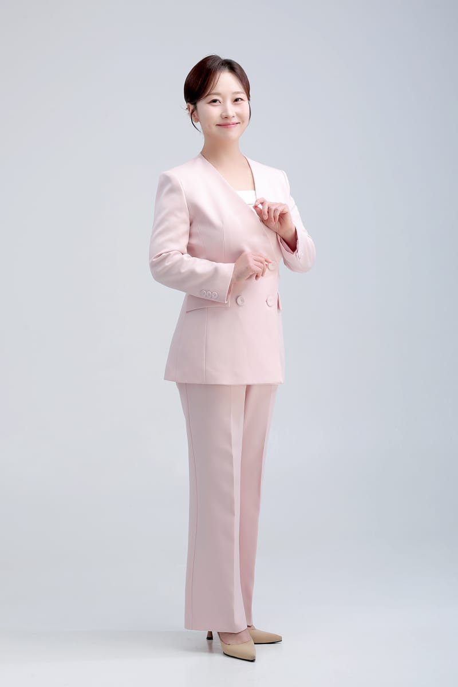

#### 경력
- 합격스피치커뮤니케이션 대표강사
- 전 멀티캠퍼스 삼성전자 강사
- 전 KBS, MBC, TBN, KCN, B-TV 아나운서 및 리포터
- 전주 MBC <할매로그> '아나운서 코칭' 편 출연

---

### 황예린
**아나운서/교수**

📍 소속: 내외경제TV

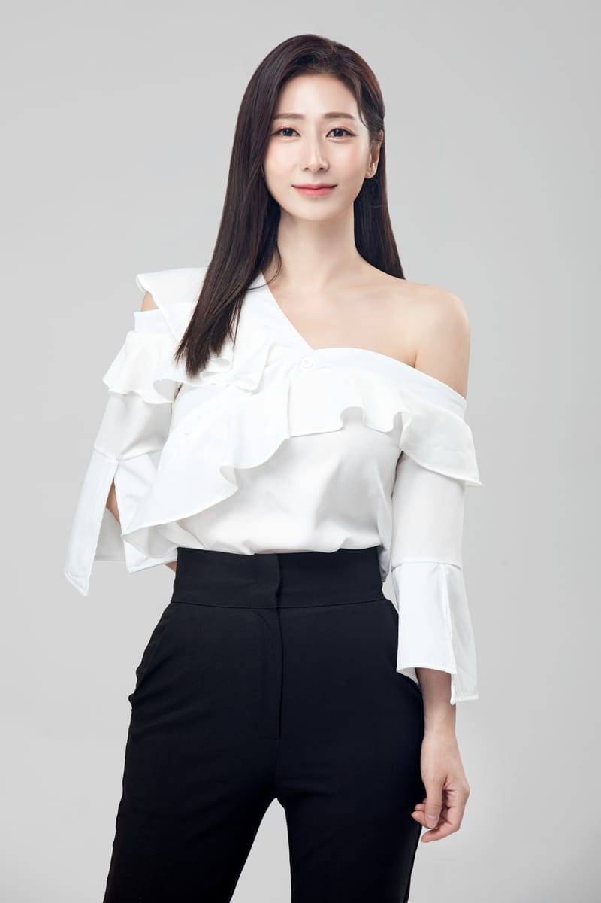

#### 경력
- 내외경제TV 아나운서
- 머니투데이방송, 서울경제TV, 매일경제TV 등 경제방송 아나운서
- AXA 손해보험 보험방송 게스트
- 현대해상 보험방송 게스트
- 춘천MBC 리포터
- 새만금 이차전지 투자협약식/3.1기념행사/광복절 경축행사 등 공식행사 MC
- 벤처인천 시상식/모범어린이대상 시상식/대교 눈높이상 시상식 등 시상식 MC
- 고용노동연수원, 경찰인재개발원, 서울경찰청, 수사연수원 등 공공기관 강의

---

### 최슬기
**한/영/일어 아나운서**

📍 소속: 글로벌 MC / 쇼홈스트

#### 학력
- 고려대학교 미디어대학원 뉴미디어전공 수료 (석사)

#### 경력
- 쿠쿠 TV홈쇼핑 게스트 (CJ, NS, GS홈쇼핑)
- 11번가 라이브11 고정PGM "생쌈" 쇼호스트
- 한국주택금융공사 아나운서
- 삼성카드 SC 설계사 교육영상 사내 아나운서
- 직방 아나운서
- 성동구청 맛집 프로그램 미스성동 리포터
- 트와이스 다현 4개국 동시 송출 글로벌 팬미팅 진행 (한국어, 영어, 일본어)
- 스페이스코인 도쿄, 싱가폴, 서울 한영일 MC
- 일본 여배우 타카다카호 국내 첫 오프라인 팬미팅 한일 MC
- 미즐비시 파워 온&오프라인 한일 MC
- 일본 라이브 방송 Q10 채널 한국인 게스트 (일본어로 진행)
- CES2024 & 2026 LG이노텍, CERAGEM 한영MC
- 대한소화기내시경학회 2024 2025 영어MC

---

### 조현정
**한/영 아나운서**

📍 소속: 국제포럼 / 정부 공식행사 전문

#### 학력 및 자격
- 서울외국어통역번역대학원 한영통역학
- 부산대학교 영어영문학/국제학

#### 전문 분야
- 국제포럼 / 정부 공식행사 진행
- 외교·보훈·국방 의전 행사
- 글로벌 기업 행사 및 컨퍼런스
- 시상식 / 창립식 / 기념식
- 한·영 이중언어 행사 진행 가능

#### 주요 진행 경력
- 한국전쟁 정전 70주년 기념 만찬 (국가보훈부)
- Cultural Policy Forum & CPI Night (문화체육관광부)
- GH 기회수도파트너스 창단식 및 창립기념식
- Upbit Developer Conference (두나무)
- 국제보훈워크숍 개회식 및 만찬
- Revisit Korea Program 공식 행사 다수
- KOREA-LAC Business Summit Start-up Pitch Day
- 국토위성과 디지털트윈국토 선포식
- 외교부·보훈처 주관 국제 만찬 및 리셉션 다수

#### 기타
- 대기업 임원 대상 영어 강의 다수
- [통역사들은 어떻게 어학의 달인이 되었을까] 공동 저자

## 📊 인력풀 요약 (PPT용)

| 이름 | 카테고리 | 소속 | 직함 |
|------|----------|------|------|
| 오수화 | 아나운서, MC, 강사 | 와이 커뮤니케이션 | 대표 |
| 이서진 | 아나운서, MC, 강사 | TBC 대구방송 | 아나운서/교수 |
| 박새하 | 아나운서, MC | MBC | 아나운서/교수 |
| 송혜지 | 아나운서, MC | MBC경남 | 아나운서/교수 |
| 권소아 | 아나운서 | 아리랑국제방송 | 앵커/한영 아나운서 |
| 정민향 | 아나운서 | 국제행사 전문 | 한영 아나운서 |
| 손세종 | 아나운서, MC, 강사 | 애터미 | 아나운서/교수 |
| 이용석 | 아나운서, MC | BBS불교방송 | 아나운서 |
| 최인경 | 아나운서, MC, 강사 | 라이브커머스코리아 | 아나운서/교수 |
| 윤채령 | 아나운서, MC | 스포츠서울TV | 아나운서 |
| 사은혜 | 아나운서, MC, 강사 | KBS 전주 | 아나운서/교수 |
| 김민정 | 아나운서, 강사 | 한국프레젠터협회 | 아나운서/교수 |
| 정애란 | 아나운서, MC | 송파구청 | 아나운서 |
| 황민지 | 아나운서, MC, 강사 | CJ 오쇼핑 | 아나운서/교수 |
| 이세경 | 아나운서, 강사 | 합격스피치커뮤니케이션 | 아나운서/교수 |
| 황예린 | 아나운서, 강사 | 내외경제TV | 아나운서/교수 |
| 최슬기 | 아나운서, MC | 글로벌 MC / 쇼홈스트 | 한/영/일어 아나운서 |
| 조현정 | 아나운서, MC | 국제포럼 / 정부 공식행사 전문 | 한/영 아나운서 |

---

*Generated: 2026-02-04*
*Total: 18 professionals*
